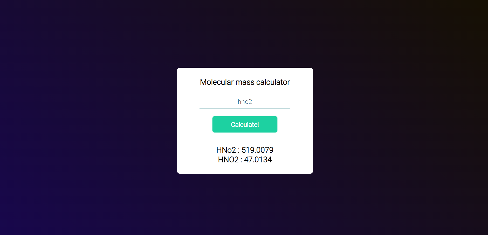

# Molecular Mass Calculator

## About

This is a simple molecular mass calculator. 
It works only with simple chemical formulas.  
The calculator is not case sensitive, it gives back all the possible formulas.
For example, if you type "hno2", the calculator will return "HNO2" and also "HNo2" 
with its corresponding mass.

## Screenshots

